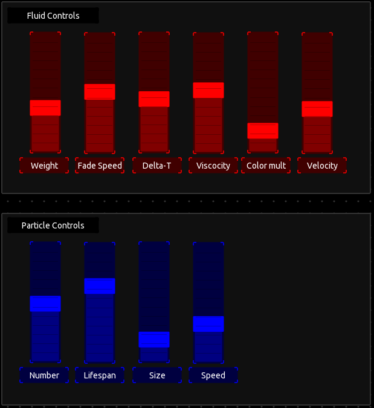
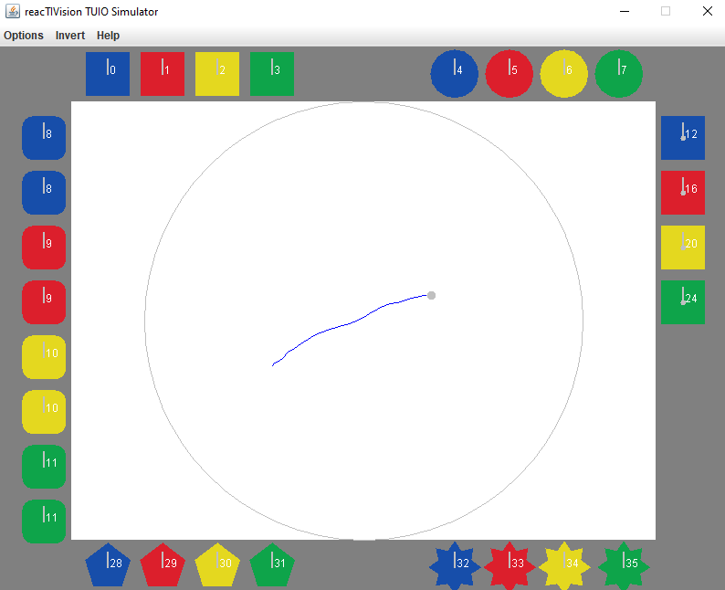

# MISK ActiveCourtain - Visualization
 Stand-alone Visualization program of Active Courtiain (for MISK)- Processing version.

Prepared by:
> Héctor Caltenco (hector.caltenco@design.lth.se)
> 
> v.241030

---

ActiveCourtain has been revived from a previous old project, [SID](https://sid.desiign.org/portfolio/activecurtain-design/). This Project is an old project, which has been reappropriated and adapted for the MISK project. The original project code as used in the SID project can be found at the [SID open source repository for the Active Courtain](https://github.com/hcaltenco/SID-ActiveCurtain). 

The Active Courtain is divided into two parts, the sensing part and the visualization part.

## Sensing program

The sensing part is based on [Kinect for Xbox 360 sensor](https://en.wikipedia.org/wiki/Kinect). The binaries are available for windows computers here: [SID Activ-Courtain Release v0.5 Windows](https://github.com/MISK-project/misk-Courtain-Processing/releases/tag/VKM-version). To run it you also need to have the [Windows Kinect SDK 1.8](https://www.microsoft.com/en-us/download/details.aspx?id=40278) installed.

The app is a modification of [KinectCoreVision](https://github.com/patriciogonzalezvivo/KinectCoreVision), developed by Patricio Gonzalez Vivo in 2011 and adapted to compile in visual studio with Kinect for Windows drivers. However, you might have problems compiling the source code in the [SID Active-Courtain repository](https://github.com/hcaltenco/SID-ActiveCurtain) mentioned above. Since it relies in an older version of openframeworks and visual studio. Moreover because of its dependency to the Microsoft Kinect SDK, the app is not compatible with other operating systems.

Experimental development to remodernize the Active courtan can be found in [it's own MISK repository](https://github.com/MISK-project/misk-courtain). Where the best plan forward is to stop using the Kinect sensor, which is not produced/sold any more. And instead use more commercially available depth cameras, such as [Intel Realsense Depth modules](https://www.intelrealsense.com/stereo-depth/). I have the ambition to continue development of this "MISK" in my spare time to make it portable and compatible with raspberry Pi, OSX, Linux and using a realsense camera instead. Alternatively, we can propose a student project around this?

In the meantime, please use a windows computer with the [SID Activ-Courtain Release v0.5 for Windows](https://github.com/MISK-project/misk-Courtain-Processing/releases/tag/VKM-version)

## Visualization programs (this repo)

The Visualization part is found in this repository. There are two branches. The [main branch](https://github.com/MISK-project/misk-Courtain-Processing) is the one used at VKM. And is an adaptation of the [SID project Active courtain visualization program](https://github.com/hcaltenco/SID-ActiveCurtain/tree/master/processing). However, it has been modernized to work with the latest version of processing, include gpu support and allow MISK to configure parameters for the fluid visuals and the particle visuals.

The [PixelFlow-Fluids branch](https://github.com/MISK-project/misk-Courtain-Processing/tree/PixelFlow-Fluids) also includes other Fluid visuals based on the [PixelFlow Processing Library](https://diwi.github.io/PixelFlow/). Use this branch if you want to experiment with other visuals which are promising. There are no OSC receive commands implemented yet in the PixelFlow sketches. But could be a fun way to vary the visuals.

There are also two other folders in the main branch:
- OSC Controller: is a [Touch-OSC](https://hexler.net/touchosc)-based controller that can write Fluid and particle parameters via OSC. E.g., to modify the fluid viscocity or the particle lifespan.

- TUIO Simulator: is a java-based application that simulates the kinect TUIO messages input if you dont have a kinect available at hand. 

### Releases
A release version of the AC visuals can be found for different platforms in the [Release page](https://github.com/MISK-project/misk-Courtain-Processing/releases/tag/VKM-version). Note that the Linux / raspbery pi version needs java runtime installed.

## Older versions
Older versions of ActiveCourtain are also available at other MISK repositories. The original ActiveCourtain can be found in the [SID repository page](https://github.com/hcaltenco/SID-ActiveCurtain/tree/master).

Max-MSP-based versions for Realsense and Oak-D cameras can be found in the [Max-patches repository](https://github.com/MISK-project/Max-patches/tree/Beta6/Depth-cam).

Different example tests for openFrameworks can be found [here](https://github.com/MISK-project/misk-courtain).
